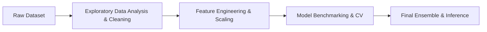

# AI Agent Operating Protocol: Kaggle Notebook Enrichment (`AGENTS.md`)

This document defines the standard operating protocol for AI coding agents (such as Antigravity, Claude Code, Cursor, Copilot, or local LLMs) when analyzing downloaded Kaggle notebooks and generating production-ready GitHub repositories.

---

## 🎯 Agent Mission

Transform raw, exploratory Kaggle `.ipynb` notebooks into professional, recruiter-grade open-source repositories by:
1. Conducting a deep technical audit of the notebook's code and markdown cells.
2. Formulating clean, domain-specific documentation (with Mermaid architecture flowcharts).
3. Sanitizing notebook execution artifacts and extracting an executable `src/main.py`.
4. Generating accurate `requirements.txt`, `.gitignore`, and `LICENSE` files.

---

## 🔍 Step 1: Notebook Audit & Intelligence Extraction

For each downloaded notebook in `downloaded_kernels/<slug>/`:

1. **Parse the JSON structure**:
   - Count total cells, code cells, and markdown cells.
   - Ignore throwaway kernels (e.g., `< 3` code cells or blank starter templates).
2. **Extract Key Signals**:
   - **Problem Domain**: Tabular Classification, Regression, Time Series, NLP, Computer Vision, Generative AI / RAG, Audio, or Data Engineering.
   - **Data Origin**: Kaggle Competition (e.g., `home-data-for-ml-course`, `spaceship-titanic`) or Community Dataset.
   - **Core Libraries**: PyTorch, TensorFlow, Scikit-Learn, XGBoost, CatBoost, LightGBM, HuggingFace, YOLO, OpenCV, etc.
   - **Validation & Metric Strategy**: Cross-Validation (K-Fold, Stratified, TimeSeriesSplit), Train-Test split ratio, target metrics (RMSE, SMAPE, Accuracy, F1-Score, AUC-ROC).
   - **Standout Engineering Decisions**: Custom feature interactions, missing value domain heuristics, outlier treatments, ensembling/blending weights, learning rate schedulers.

---

## 📝 Step 2: Documentation Generation (`README.md`)

The agent MUST generate a `README.md` following this structure:

### 1. Header & Badges
- Project Title (clean and descriptive, e.g., `House Prices Prediction — Kaggle Top 1% Solution`).
- First line: A human-friendly, concise summary of what the project solves and accomplishes.
- Badges: Kaggle Notebook URL, License, Python 3.9+, Problem Domain badge.

### 2. Key Highlights & Technical Results (4–6 Bullet Points)
Focus on concrete engineering and modeling decisions. Avoid generic statements like "trained a model".
* *Good*: "Engineered leak-free preprocessing using Scikit-Learn `ColumnTransformer` to prevent data leakage during 5-fold cross-validation."
* *Good*: "Benchmarked CatBoost, XGBoost, and LightGBM, ensembling predictions to achieve 81.2% accuracy."
* *Bad*: "Created machine learning models."

### 3. Pipeline Architecture (Mermaid Diagram)
Construct a valid Mermaid diagram illustrating the actual workflow:


### 4. Repository Structure
```plaintext
<repo_name>/
├── notebooks/
│   └── <repo_name>.ipynb      # Original Jupyter notebook with visuals
├── src/
│   └── main.py                # Standalone, runnable pipeline script
├── .gitignore                 # Standard Python/Jupyter/data ignores
├── LICENSE                    # MIT License
├── README.md                  # Comprehensive technical documentation
└── requirements.txt           # Minimal verified dependencies
```

### 5. Quickstart & Reproduction
- Virtual environment creation (`python -m venv venv`).
- Dependency installation (`pip install -r requirements.txt`).
- Dataset download command:
  - If competition: `kaggle competitions download -c <competition_name>`
  - If dataset: `kaggle datasets download -d <dataset_slug>`
- Running `python src/main.py` or launching the notebook.

---

## 🛠️ Step 3: Code Extraction & Sanitization (`src/main.py`)

When converting the notebook into `src/main.py`:

1. **Strip or Comment Out Magics**:
   - Lines starting with `!` (e.g. `!pip install ...`, `!kaggle ...`, `!ls`) must be converted to `# !...`.
   - Lines starting with `%` (e.g. `%matplotlib inline`, `%cd ...`) must be converted to `# %...`.
2. **Smart Dataset Path Resolution**:
   Inject the following path resolver at the top of `src/main.py` so the script runs locally if the user downloads the dataset into `data/` or the root directory:
   ```python
   def _resolve_data_path(file_path: str) -> str:
       """Resolves dataset paths if default /kaggle/input/ directory is missing."""
       if os.path.exists(file_path):
           return file_path
       base = os.path.basename(file_path)
       candidates = [
           base,
           os.path.join("data", base),
           os.path.join("..", "data", base),
           file_path.replace("/kaggle/input/", "data/"),
           file_path.replace("../input/", "data/"),
       ]
       for candidate in candidates:
           if os.path.exists(candidate):
               return candidate
       return file_path
   ```
   Wrap raw path references (e.g., `pd.read_csv('/kaggle/input/...')`) with `_resolve_data_path(...)`.
3. **Execution Guard**:
   Wrap the script execution with `if __name__ == "__main__":`.

---

## 📦 Step 4: Dependency Inference (`requirements.txt`)

Map imported Python modules to their respective PyPI package distribution names:
- `cv2` ➡️ `opencv-python`
- `sklearn` ➡️ `scikit-learn`
- `PIL` ➡️ `pillow`
- `yaml` ➡️ `pyyaml`
- `bs4` ➡️ `beautifulsoup4`
- Standard library modules (e.g., `os`, `sys`, `re`, `json`, `math`, `time`, `pathlib`) must **never** be included.

---

## 🚀 Step 5: Verification Checklist

Before publishing any repository, the agent must verify:
- [ ] `notebooks/<name>.ipynb` is valid JSON and opens cleanly.
- [ ] `src/main.py` has no unhandled IPython syntax errors (`!` or `%`).
- [ ] `requirements.txt` contains valid PyPI package names.
- [ ] `.gitignore` prevents committing `.csv`, `.parquet`, `.pt`, `.h5`, and virtual environments.
- [ ] `README.md` contains a valid, error-free Mermaid diagram and valid URLs.
- [ ] `LICENSE` is present.
