# kaggle2github 🚀

> **Transform raw Kaggle notebooks into production-ready, recruiter-grade GitHub repositories.**

[](LICENSE)
[](https://www.python.org/downloads/)
[](https://github.com/Kaggle/kaggle-api)
[](https://docs.github.com/en/rest)

---

## The Problem

Data scientists and ML engineers build dozens of impressive notebooks on Kaggle with real-world datasets, ensembling techniques, and deep learning architectures. However:
1. **Recruiters and hiring managers don't browse Kaggle** — they evaluate candidates on GitHub based on software engineering discipline (clean folder structures, modular scripts, `.gitignore`, dependency isolation, and clear documentation).
2. **Kaggle notebooks are dirty when exported**:
   - Hardcoded `/kaggle/input/...` file paths fail when executed locally.
   - Shell magics (`!pip install`, `%matplotlib inline`, `%cd`) break standard Python runners.
   - Missing `requirements.txt`, licenses, and project structures.
   - Lack of architecture diagrams or quickstart reproduction steps.

`kaggle2github` solves this automatically.

---

## What `kaggle2github` Does

```mermaid
flowchart LR
    A[Kaggle Profile / API] --> B[Catalog & Filter Engine]
    B --> C[Sanitization Engine]
    C --> D[Packaging Engine]
    D --> E[GitHub Multi-Repo Engine]

    subgraph C [Sanitization Engine]
        C1[Strip Shell & IPython Magics]
        C2[Smart Dataset Path Fallbacks /kaggle/input -> data/]
        C3[Extract Clean src/main.py]
    end

    subgraph D [Packaging Engine]
        D1[AST Import Extractor -> requirements.txt]
        D2[System Architecture Mermaid Diagrams]
        D3[.gitignore & MIT License]
        D4[Kaggle Badges & CLI dataset downloaders]
    end

    subgraph E [GitHub Multi-Repo Engine]
        E1[Automated Repo Creation]
        E2[Topic Tagging]
        E3[Git Commit & Push to main]
    end
```



For every notebook you select, `kaggle2github` produces a standalone, production-ready GitHub repository:

```plaintext
my-project-repo/
├── notebooks/
│   └── my-project-repo.ipynb    # Original Jupyter notebook with visuals & outputs
├── src/
│   └── main.py                  # Clean, executable Python script with dataset path fallback
├── .gitignore                   # Standard Python, Jupyter, model weight & data ignores
├── LICENSE                      # MIT / Apache License
├── requirements.txt             # Auto-extracted minimal dependencies
└── README.md                    # Beautiful, recruiter-ready documentation with Mermaid diagram
```

---

## Quickstart & Installation

```bash
# Clone the repository
git clone https://github.com/musaoc/kaggle2github.git
cd kaggle2github

# Install in editable mode
pip install -e .
```

Or install the dependencies directly:
```bash
pip install kaggle rich
```

### Authentication Setup

1. **Kaggle API**: Place your `kaggle.json` inside `~/.kaggle/` (or set `KAGGLE_USERNAME` and `KAGGLE_KEY` environment variables).
2. **GitHub Token**: Generate a GitHub Personal Access Token (`repo` scope) and set:
   ```bash
   export GITHUB_TOKEN="ghp_yourPersonalAccessTokenHere"
   # On Windows PowerShell:
   # $env:GITHUB_TOKEN="ghp_yourPersonalAccessTokenHere"
   ```

---

## CLI Usage

### 1. Scan your Kaggle Notebooks
Inspect your public work, vote counts, languages, and competitions:
```bash
kaggle2github scan --user <your_kaggle_username>
```

### 2. Download Selected or All Notebooks
Download notebooks into a local staging directory:
```bash
# Download all notebooks
kaggle2github download --user <your_kaggle_username>

# Or download specific kernels by slug
kaggle2github download --user <your_kaggle_username> --slugs house-prices-eda spaceship-titanic
```

### 3. Build Production Multi-Repositories
Transform downloaded notebooks into standalone repository structures:
```bash
kaggle2github build --input-dir downloaded_kernels --output-dir repos
```

### 4. Publish to GitHub
Create remote GitHub repositories, configure topics, and push commits:
```bash
# Push all built repositories as private repos (default)
kaggle2github publish --repos-dir repos --user <your_github_username>

# Or push directly as public repositories
kaggle2github publish --repos-dir repos --user <your_github_username> --public
```

### 5. All-in-One Workflow
Run the entire pipeline from scan to publish in a single command:
```bash
kaggle2github run-all --kaggle-user <kuser> --github-user <ghuser>
```

---

## 🤖 AI Agent Workflow (`AGENTS.md`)

`kaggle2github` includes an **[`AGENTS.md`](AGENTS.md)** protocol. 

If you use AI coding agents (such as **Antigravity**, **Claude Code**, **Cursor**, or **Gemini CLI**), the agent can read `AGENTS.md` and autonomously:
1. Deep-inspect every cell in downloaded notebooks.
2. Formulate domain-specific architectural summaries and key engineering highlights.
3. Generate custom **Mermaid workflow diagrams** illustrating the model's exact data transformation pipeline.
4. Refactor `src/main.py` into modular classes or functions if desired.

---

## Contributing & License

Contributions, feature requests, and PRs are welcome!
Licensed under the [MIT License](LICENSE).
